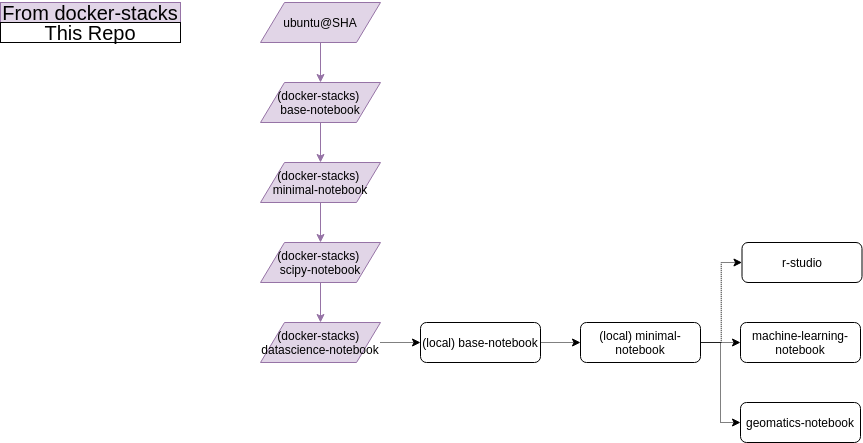
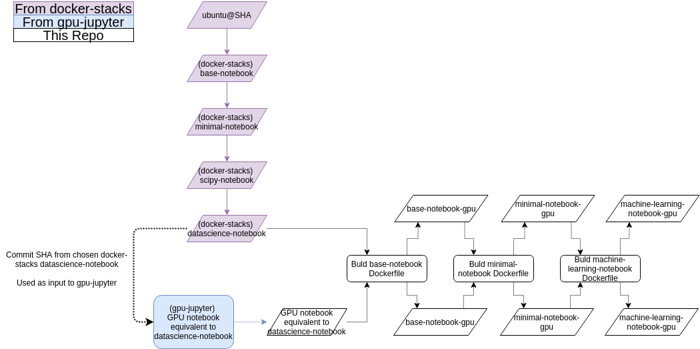

# Containers for Kubeflow

Containers to be used with Kubeflow for Data Science.

## Introduction

These container images are based on the community driven [jupyter/docker-stacks](https://github.com/jupyter/docker-stacks), which maintains a [data science](https://jupyter-docker-stacks.readthedocs.io/en/latest/using/selecting.html#jupyter-datascience-notebook) Jupyterlab notebook image with many standard tools installed.  The local repo builds on this upstream image by adding additional tools, with the hierarchy shown below:



`docker-stacks` images support only CPU-driven computation, but the parallel effort from [iot-salzburg/gpu-jupyter](https://github.com/iot-salzburg/gpu-jupyter) provides tools to create GPU-driven versions of the `docker-stacks` images as well.  `gpu-jupyter`'s scripts take a `docker-stacks` commit SHA as input and recreate the data science Dockerfile from that commit using an NVIDIA/CUDA enabled base image.  To enable both CPU- and GPU-driven versions of most images, the `Dockerfile`s here (`base-notebook`, `minimal-notebook`, ...) accept their base image as a `build-arg`  - this allows both the CPU and GPU stacks to be build using a single core set of `Dockerfile`'s.  This is shown for a subset of the images below:



As summary of each step is given in their respective `readme.md` files. The notebooks intended for deployment to users are the `minimal-notebook-*`, `machine-learning-notebook-*`, `geomatics`, and `r-studio`.  

## Testing and Local Builds

For building locally, `build_cpu_local.sh` and `build_gpu_local.sh` provide recipes to build each stream.  Some settings for base image selection are provided in `build_settings.env`.  Each image subdir also has build scripts for its respective build.

To test locally, build the image you need then run it with port forwarding like:

```
docker run 8888:SOME_LOCAL_PORT IMAGENAME
```

where you add a local port and imagename.  Then open a browser and go to `localhost:SOME_LOCAL_PORT`.

## Deployment and CI

Github Actions CI is set up to build and deploy the images on merge to master.  Settings defining the base images used for CI (from `docker-stacks` and from `gpu-jupyter`) are defined in `build_settings.env`.  

To reduce build times, the Github Actions CI workflow attempts to pull the latest version of each image from ACR before building.  In cases where cached layers can be reused, this can considerably reduce build time (at the cost of some data transfer time).  In general this appears to be of net benefit (if changing upstream images or `base-notebook` total build times will be ~5 minute slower, but if iterating on any other image build times will be ~10-60 minutes faster).

## Development Notes

### Set User File Permissions after Every `pip`/`conda` Install or Edit of User's Home Files

Installs in the `Dockerfile`s occur as the **root** user, but all `Dockerfile`s end with `USER jovyan` to ensure end users do not have excess priviledges.  This means that installation of anything that should be user editable (eg: `pip` and `conda` installs, additional files in `/home/$NB_USER`, etc.) will by default be owned by **root**.  This causes issues for users later if they write to these locations (eg: `pip install` or `conda install` of any package, or by editing a user settings file in their `/home/$NB_USER`).

To fix this issue, end any `RUN` command that edits any user-editable files with:

```
fix-permissions $CONDA_DIR && \
fix-permissions /home/$NB_USER
```

This fix edits the permissions of files in these locations to allow user access.  Note that if these are not applied **in the same layer as when the new files were added** it will result in a duplication of data in the layer because the act of changing permissions on a file from a previous layer requires a copy of that file into the current layer.  So something like:

```
RUN add_1GB_file_with_wrong_permissions_to_NB_USER.sh && \
	fix-permissions /home/$NB_USER
```

would add a single layer of about 1GB, whereas

```
RUN add_1GB_file_with_wrong_permissions_to_NB_USER.sh

RUN fix-permissions /home/$NB_USER
```

would add two layers, each about 1GB (2GB total).

### CPU and GPU Ubuntu Versions

The CPU and GPU images provided here contain the same software **except for Ubuntu versions**.  The `docker-stacks` images are based on Ubuntu 20.04, whereas the GPU version uses Ubuntu 18.04.  This is caused by a conflict betwen PyTorch/CUDA 11/Ubuntu 20.04, and can be resolved once the upstream conflict is addressed (watch `gpu-jupyter` for progress).