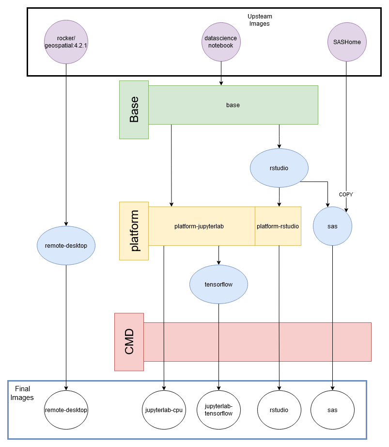
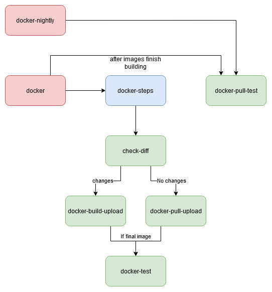

# aaw-kubeflow-containers <!-- omit in toc -->

Container images to be used with kubeflow on the AAW platform for Data Science & other workloads.

## Table of Contents <!-- omit in toc -->

- [Introduction](#introduction)
- [List of maintained images in this github repository](#list-of-maintained-images-in-this-github-repository)
- [Using](#using)
  - [Building and Tagging Docker Images](#building-and-tagging-docker-images)
  - [Pulling and Pushing Docker Images](#pulling-and-pushing-docker-images)
  - [Testing images](#testing-images)
    - [Running and Connecting to Images Locally/Interactively](#running-and-connecting-to-images-locallyinteractively)
    - [Automated Testing](#automated-testing)
- [General Development Workflow](#general-development-workflow)
  - [Running an AAW Container Locally](#running-an-aaw-container-locally)
  - [Testing Locally](#testing-locally)
  - [Testing On-Platform testing](#testing-on-platform-testing)
  - [Overview of images](#overview-of-images)
  - [Adding new software](#adding-new-software)
  - [Adding new Images](#adding-new-images)
  - [Modifying and Testing CI](#modifying-and-testing-ci)
- [Other Development Notes](#other-development-notes)
  - [Github CI](#github-ci)
  - [The `latest` and `v1` tags for the master branch](#the-latest-and-v1-tags-for-the-master-branch)
  - [Set User File Permissions](#set-user-file-permissions)
  - [Troubleshooting](#troubleshooting)
- [Structure](#structure)

## Introduction

Our Container images are based on the community driven [jupyter/docker-stacks](https://github.com/jupyter/docker-stacks).
We chose those images because they are continuously updated and install the most common utilities.
This enables us to focus only on the additional toolsets that we require to enable our data scientists.
These customized images are maintained by the AAW team and are the default images available on the kubeflow UI.

This is different from the [aaw-contrib-containers](https://github.com/StatCan/aaw-contrib-containers) as those images are built by AAW user-base.
These are often created when a user's workload is more specific and our generic images are not suitable for them.
Those images can be used via the `custom-image` feature in kubeflow and do not populate the default images drop-down.
Additionally, the AAW team is not responsible for maintaining those images.

## List of maintained images in this github repository

| Image Name                         | Notes                                                                                                                                           | Extra Installations  |
| ---------------------------------- | ----------------------------------------------------------------------------------------------------------------------------------------------- | -------------------- |
| jupyterlab-cpu                     | The base experience. A jupyterlab notebook with various installations.                                                                          | VsCode, R, Julia     |
| jupyterlab-tensorflow              | For users looking to leverage a GPU machine. Comes installed with tensorflow                                                                    | tensorflow-gpu       |
| remote-desktop                     | For users looking to have a desktop-like experience.                                                                                            | Open M++, QGIS       |
| rstudio                            | For users looking to have a rstudio tuned experience.                                                                                           |                      |
| sas                                | Similar to our jupyterlab-cpu image, except with SAS. This is only available to Statistics Canada employees as that is what our license allows. |                      |

## Using

### Building and Tagging Docker Images

Use `make build/IMAGENAME` to build a `Dockerfile`.
This by default generates images with:

- `repo=k8scc01covidacr.azurecr.io`
- `tag=BRANCH_NAME`
  For example: `k8scc01covidacr.azurecr.io/IMAGENAME:BRANCH_NAME`.

`make build` also accepts arguments for REPO and TAG to override these behaviours.
For example, `make build/jupyterlab-cpu REPO=myrepo TAG=notLatest`.

`make post-build/IMAGENAME` is meant for anything that is commonly done after building an image, but currently only adds common tags.
It adds tags of SHA, SHORT_SHA, and BRANCH_NAME to the given image,
and accepts a `SOURCE_FULL_IMAGE_NAME` argument if you're trying to tag an existing image that has a non-typical name.
For example:

- `make post-build/IMAGENAME` will apply SHA, SHORT_SHA, and BRANCH_NAME tags to `k8scc01covidacr.azurecr.io/IMAGENAME:BRANCH_NAME` (eg: using the default REPO and TAG names)
- `make post-build/IMAGENAME SOURCE_FULL_IMAGE_NAME=oldRepo/oldImage:oldTag REPO=newRepo` will make the following new aliases for `oldRepo/oldImage:oldTag REPO=newRepo`:
  - `newRepo/IMAGENAME:SHA`
  - `newRepo/IMAGENAME:SHORT_SHA`
  - `newRepo/IMAGENAME:BRANCH_NAME`

### Pulling and Pushing Docker Images

`make pull/IMAGENAME` and `make push/IMAGENAME` work similarly to `make build/IMAGENAME`.
They either push a local image to the acr, or pull and exisitng one from acr to local. 
The `REPO` and `TAG` arguments are available to override their default values.

**Note:** To use `make pull` or `make push`,
you must first log in to ACR (`az acr login -n k8scc01covidacr`)

**Note:** `make push` by default does `docker push --all-tags` in order to push the SHA, SHORT_SHA, etc., tags.

### Testing images

#### Running and Connecting to Images Locally/Interactively

To test an image interactively, use `make dev/IMAGENAME`.
This calls `docker run` on a built image,
automatically forwarding ports to your local machine and providing a link to connect to.
The site can then be tested localy.

#### Automated Testing

Automated tests are included for the generated Docker images using `pytest`.
This testing suite is modified from the [docker-stacks](https://github.com/jupyter/docker-stacks) test suite.
Image testing is invoked through `make test/IMAGENAME` (with optional `REPO` and `TAG` arguments like `make build`).

Testing of a given image consists of general and image-specific tests:

```
└── tests
    ├── general                             # General tests applied to all images
    │   └── some_general_test.py
    ├── jupyterlab-cpu                      # Test applied to a specific image
    │   └── some_jupyterlab-cpu-specific_test.py
    └── jupyterlab-tensorflow
```

Where `tests/general` tests are applied to all images,
and `tests/IMAGENAME` are applied only to a specific image.
Pytest will start the image locally and then run the provided tests to determine if Jupyterlab is running, python packages are working properly, etc.
Tests are formatted using typical pytest formats (python files with `def test_SOMETHING()` functions).
`conftest.py` defines some standard scaffolding for image management, etc.

---

## General Development Workflow

### Running an AAW Container Locally

1. Clone the repository with `git clone https://github.com/StatCan/aaw-kubeflow-containers`.
2. Run `make install-python-dev-venv` to build a development Python virtual environment.
3. Build your image using `make build/IMAGENAME DIRECTORY=STAGENAME`, e.g. run `make build/jupyterlab-tensorflow DIRECTORY=cmd`.
4. Test your image using automated tests through `make test/IMAGENAME`, e.g. run `make test/jupyterlab-tensorflow`.
5. Veiw your images with `docker images`. You should see a table printed in the console with your images. For example you may see:

```
username@hostname:~$ docker images
REPOSITORY                                         TAG            IMAGE ID       CREATED          SIZE
k8scc01covidacr.azurecr.io/jupyterlab-tensorflow   master         13f8dc0e4f7a   26 minutes ago   14.6GB
k8scc01covidacr.azurecr.io/jupyterlab-pytorch      master         2b9acb795079   19 hours ago     15.5GB
jupyter/datascience-notebook                       9ed3b8de5de1   9a0c8d86de1a   5 weeks ago      4.25GB
```

7. Run your image with `make dev/IMAGENAME`,
   e.g. `make dev/jupyterlab-tensorflow`.
8. Open [http://localhost:8888](http://localhost:8888) or `<ip-address-of-server>:8888`.

### Testing Locally

1. Clone the repo
2. (optional) `make pull/IMAGENAME TAG=SOMEEXISTINGTAG` to pull an existing version of the image you are working on
   (this could be useful as a build cache to reduce development time below)
3. Edit an image via the [image stages](/images) that are used to create it.
4. Build your edited stages and any dependencies using `make build/IMAGENAME DIRECTORY=STAGENAME`
5. Test your image:
   - using automated tests through `make test/IMAGENAME`
   - manually by `docker run -it -p 8888:8888 REPO/IMAGENAME:TAG`,
     then opening it in [http://localhost:8888](http://localhost:8888)

### Testing On-Platform testing

GitHub Actions CI is enabled to do building, scanning, automated testing, pushing of our images to ACR.

Build, test, and scan CI triggers on:

- any push to master
- any push to an open PR
  This allows for easy scanning and automated testing for images.

Pushing images to ACR triggers on:

- any push to master
- any push to an open PR **that also has the `auto-deploy` label**

Pushes to the `master` branch will push to the k8scc01covidacr.azurecr.io ACR and these are accessible from both the dev and prod cluster.
You can access these images using any of the following:

- k8scc01covidacr.azurecr.io/IMAGENAME:SHA
- k8scc01covidacr.azurecr.io/IMAGENAME:SHORT_SHA
- k8scc01covidacr.azurecr.io/IMAGENAME:latest
- k8scc01covidacr.azurecr.io/IMAGENAME:v1

Pushes to an open PR **that also has the `auto-deploy` label on the PR** are accessible only from the dev cluster
You can access these images using any of the following:

- k8scc01covidacrdev.azurecr.io/IMAGENAME:SHA
- k8scc01covidacrdev.azurecr.io/IMAGENAME:SHORT_SHA
- k8scc01covidacrdev.azurecr.io/IMAGENAME:BRANCHNAME
- k8scc01covidacrdev.azurecr.io/IMAGENAME:dev (for convenience in testing)

Images pushed to the dev acr are only available to the DEV cluster, attempting to use them in prod will fail.

NOTE: ACR has an image retention policy of 7 days. However it is currently disabled.

### Overview of images

Each directory in the images folder makes up one stage of the build process.
They each contain the Dockerfile that directs the build, and all related files.

The relationship between the stages and the final product is as shown below.


All output images should meet the following criteria:

### Adding new software

Software needs to be added by modifying the relevant image stage,
then following the normal build instructions starting with the Generate Dockerfiles step.

Be selective with software installation as image sizes are already quite big (16Gb plus),
and increasing that size would negatively impact the time it takes up for a workspace server to come up
(as well as first time image pulls to a node).
In such cases it may be more relevant to make an image under [aaw-contrib-containers](https://github.com/StatCan/aaw-contrib-containers) as mentioned earlier.

### Adding new Images

1. Identify what stages are needed, and if the image will build from an existing stage
2. Create a new subdirectory in the `/images/` directory for each new stage
3. Add new jobs to the `./github/workflows/docker.yaml` for each new stage. 

### Modifying and Testing CI

If making changes to CI that cannot be done on a branch (eg: changes to issue_comment triggers), you can:

1. fork the 'kubeflow-containers' repo
2. Modify the CI with

- REGISTRY: (your own dockerhub repo, eg: "j-smith" (no need for the full url))
- Change
  ```
  - uses: azure/docker-login@v1
    with:
      login-server: ${{ env.REGISTRY_NAME }}.azurecr.io
      username: ${{ secrets.REGISTRY_USERNAME }}
      password: ${{ secrets.REGISTRY_PASSWORD }}
  ```
  to
  ```
  - uses: docker/login-action@v1
    with:
      username: ${{ secrets.REGISTRY_USERNAME }}
      password: ${{ secrets.REGISTRY_PASSWORD }}
  ```

3. In your forked repo, define secrets for REGISTRY_USERNAME and REGISTRY_PASSWORD with your dockerhub credentials (you should use an API token, not your actual dockerhub password)

---

## Other Development Notes

### Github CI

The Github workflow is set up to build the images and their dependant stages.
See below for a flowchart of this build.

The main workflow is `docker.yaml`,
it controls the stage build order, and what triggers the CI.
(Pushes to master, pushes to an open pull-request, and nightly builds)

The building of a stage is controled by `docker-steps.yaml`.
It checks if there are changes to the stage or dependant stages.
Builds a new image if there are changes, 
or pulls a copy of the existing image if not.
Testing will be performed if this is the final stage in the build of an image.



### The `latest` and `v1` tags for the master branch

These tags are intended to be `long-lived` in that they will not change.
Subsequent pushes will clobber the previous `IMAGENAME:latest` image.
This means that `IMAGENAME:latest` will be updated automatically as changes are made,
so updates to the tag are not needed.

The `v1` tag is intended for when we encounter a breaking change,
but still want to support the features of that current image.
A new `v2` tag will be created for adding these breaking changes.

### Set User File Permissions

The Dockerfiles in this repo are intended to construct compute environments for a non-root user **jovyan** to ensure the end user has the least privileges required for their task,
but installation of some of the software needed by the user must be done as the **root** user.
This means that installation of anything that should be user editable (eg: `pip` and `conda` installs, additional files in `/home/$NB_USER`, etc.) will by default be owned by **root** and not modifiable by **jovyan**.
**Therefore we must change the permissions of these files to allow the user specific access for modification.**
For example, most pip install/conda install commands occur as the root user and result in new files in the $CONDA_DIR directory that will be owned by **root** and cause issues if user **jovyan** tried to update or uninstall these packages
(as they by default will not have permission to change/remove these files).

To fix this issue, end any `RUN` command that edits any user-editable files with:

```
fix-permissions $CONDA_DIR && \
fix-permissions /home/$NB_USER
```

This fix edits the permissions of files in these locations to allow user access.
Note that if these are not applied **in the same layer as when the new files were added** it will result in a duplication of data in the layer because the act of changing permissions on a file from a previous layer requires a copy of that file into the current layer.
So something like:

```
RUN add_1GB_file_with_wrong_permissions_to_NB_USER.sh && \
	fix-permissions /home/$NB_USER
```

would add a single layer of about 1GB, whereas

```
RUN add_1GB_file_with_wrong_permissions_to_NB_USER.sh

RUN fix-permissions /home/$NB_USER
```

would add two layers, each about 1GB (2GB total).

### Troubleshooting

If running using a VM and RStudio image was built successfully but is not opening correctly on localhost (error 5000 page),
change your CPU allocation in your Linux VM settings to >= 3.
You can also use your VM's system monitor to examine if all CPUs are 100% being used as your container is running.
If so, increase CPU allocation.
This was tested on Linux Ubuntu 20.04 virtual machine.

## Structure

```
.
├── .github/workflow                        # Github CI. Controls the stage build order
│
├── Makefile                                # Controls the interactions with docker commands
│
├── make_helpers                            # Scripts used by makefile
│   ├── get_branch_name.sh
│   ├── get-nvidia-stuff.sh
│   └── post-build-hook.sh
│
├── images                                  # Dockerfile and required resources for stage builds
│   ├── base                                # Common stage for most images
│   ├── cmd                                 # Common stage for finalizing most images
│   ├── platform
│   ├── remote-desktop
│   ├── rstudio
│   ├── sas
│   └── tensorflow
│
├── docs                                    # files/images used in documentation (ex. Readme's)
│
└── tests
    ├── general/                            # General tests applied to all images
    ├── jupyterlab-cpu/                     # Test applied to a specific image
    ├── jupyterlab-pytorch/
    ├── jupyterlab-tensorflow/
    └── README.md
```
