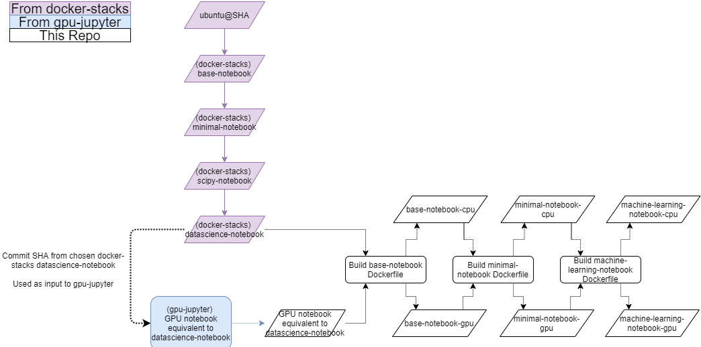

# Containers for Kubeflow

Containers to be used with Kubeflow for Data Science.

## Introduction

These container images are based on the community driven [jupyter/docker-stacks](https://github.com/jupyter/docker-stacks), which maintains a [data science](https://jupyter-docker-stacks.readthedocs.io/en/latest/using/selecting.html#jupyter-datascience-notebook) Jupyterlab notebook image with many standard tools installed.  The local repo builds on this upstream image by adding additional tools, with the hierarchy shown below:

`docker-stacks` images support only CPU-driven computation, but the parallel effort from [iot-salzburg/gpu-jupyter](https://github.com/iot-salzburg/gpu-jupyter) provides tools to create GPU-driven versions of the `docker-stacks` images as well.  `gpu-jupyter`'s scripts take a `docker-stacks` commit SHA as input and recreate the data science Dockerfile from that commit using an NVIDIA/CUDA enabled base image.  To enable both CPU- and GPU-driven versions of most images, the `Dockerfile`s here (`base-notebook`, `minimal-notebook`, ...) accept their base image as a `build-arg`  - this allows both the CPU and GPU stacks to be build using a single core set of `Dockerfile`'s.  This is shown for a subset of the images below:

As summary of each step is given in their respective `readme.md` files. The notebooks intended for deployment to users are the `minimal-notebook-*`, `machine-learning-notebook-*`, `geomatics`, and `r-studio`.  

## Testing and Local Builds

For testing and building locally, `build_cpu_local.sh` and `build_gpu_local.sh` provide recipes to build each stream.  Some settings for base image selection are provided in `build_settings.env`.  Each image subdir also has build scripts for its respective build.

## Deployment and CI

Github Actions CI is set up to build and deploy the images on merge to master.  Settings defining the base images used for CI (from `docker-stacks` and from `gpu-jupyter`) are defined in `build_settings.env`.  

To reduce build times, the Github Actions CI workflow attempts to pull the latest version of each image from ACR before building.  In cases where cached layers can be reused, this can considerably reduce build time (at the cost of some data transfer time).  In general this appears to be of net benefit (if changing upstream images or `base-notebook` total build times will be ~5 minute slower, but if iterating on any other image build times will be ~10-60 minutes faster).
